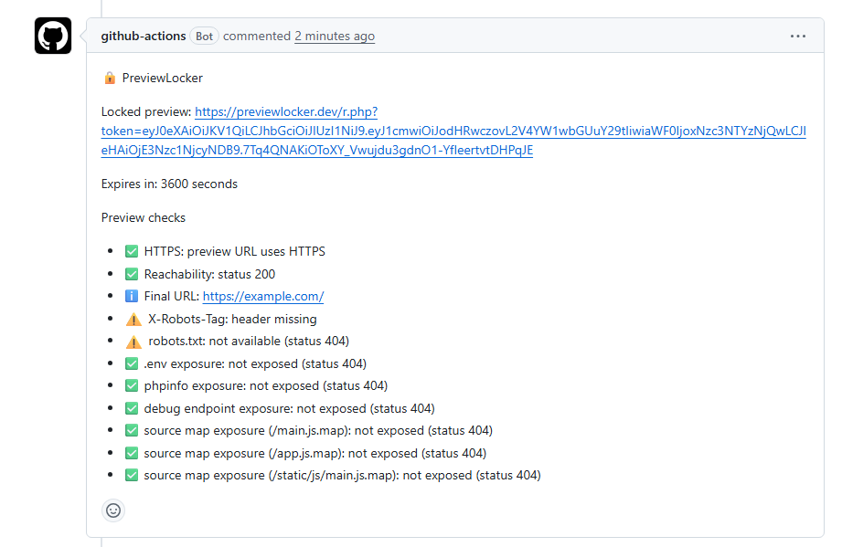

# PreviewLocker GitHub Action

[](https://github.com/marketplace/actions/preview-locker)
[](https://github.com/ModelGuardHQ-Tools/preview-locker-action/actions/workflows/ci.yml)
[](LICENSE)

Create locked, expiring sharing links for pull request and staging preview environments.

Preview Locker helps teams share staging and preview URLs with less accidental exposure by issuing time-limited locked links from a standard GitHub Actions step.

## What it looks like in a pull request

PreviewLocker can post a pull request comment with the locked preview URL and basic preview security checks:



See the working demo repository:
https://github.com/ModelGuardHQ-Tools/previewlocker-demo

## Why Use It

- Protect preview links before sharing them with reviewers, clients, or stakeholders.
- Add expiring access without changing your existing deployment workflow.
- Work with any platform that gives you a preview URL.

## Current Features

- Accepts a `preview_url` from your workflow.
- Exchanges that URL for a locked, expiring Preview Locker link.
- Returns the locked URL as a GitHub Actions output.
- Supports configurable expiration via `expires_in`.
- Can optionally create or update a pull request comment with the locked preview link.
- Can optionally run basic preview security checks and report findings.

## Quick Start

```yaml
name: Preview Locker

on:
  workflow_dispatch:

jobs:
  lock-preview:
    runs-on: ubuntu-latest
    steps:
      - uses: actions/checkout@v4

      - name: Create locked preview link
        id: lock
        uses: ModelGuardHQ-Tools/preview-locker-action@v1
        with:
          api_key: ${{ secrets.PREVIEW_LOCKER_API_KEY }}
          preview_url: https://preview.example.com/build-123
          expires_in: 3600

      - name: Show locked preview link
        run: echo "Locked preview URL: ${{ steps.lock.outputs.url }}"
```

## Inputs

| Input | Description | Required | Default |
| ----- | ----------- | -------- | ------- |
| `api_key` | Your Preview Locker API key | Yes | — |
| `preview_url` | The original preview URL to protect | Yes | — |
| `expires_in` | Expiration time in seconds for the link | No | `3600` |
| `comment_on_pr` | Post the locked preview link as a pull request comment | No | `false` |
| `github_token` | GitHub token used to create or update the pull request comment | No | — |
| `scan_preview` | Run basic security checks against the preview URL | No | `false` |
| `scan_timeout_ms` | Timeout for each preview security request | No | `5000` |
| `fail_on_risk` | Fail workflow when preview checks warn | No | `false` |

## Outputs

| Output | Description                      |
| ------ | -------------------------------- |
| `url`  | The locked, expiring preview URL |

## Comment on Pull Requests

Use this workflow pattern when you want the action to post the locked preview link directly on a pull request. The action will update its latest PreviewLocker comment on repeated runs instead of creating duplicates.

```yaml
name: Preview Locker PR Comment

on:
  pull_request:

permissions:
  contents: read
  issues: write
  pull-requests: read

jobs:
  lock-preview:
    runs-on: ubuntu-latest
    steps:
      - uses: actions/checkout@v4

      - name: Create locked preview link and comment on PR
        id: lock
        uses: ModelGuardHQ-Tools/preview-locker-action@v1
        with:
          api_key: ${{ secrets.PREVIEW_LOCKER_API_KEY }}
          preview_url: https://preview.example.com/build-123
          expires_in: 3600
          comment_on_pr: true
          github_token: ${{ secrets.GITHUB_TOKEN }}

## Preview Security Checks

Preview Security Checks V1 adds lightweight, best-effort checks against your preview URL and reports findings in the workflow logs. When used together with pull request comments, the action also appends a short "Preview checks" section to the PreviewLocker comment.

V1 is informational only. It reports findings and unavailable checks, but it does not fail CI yet.

You can optionally enable `fail_on_risk: true` to fail the workflow when any preview check returns a `warn` finding.

Only `warn` findings fail the workflow. `info` findings, including unavailable checks, do not fail the workflow.

Current V1 checks include:

- HTTPS usage on the preview URL
- Reachability and HTTP status
- Final response URL after redirects when available
- `X-Robots-Tag` presence with a `noindex` signal
- `robots.txt` presence and whether it includes `Disallow: /`
- Basic exposure probes for `/.env`, `/phpinfo.php`, `/debug`, and common source map paths

```yaml
name: Preview Locker PR Comment With Checks

on:
  pull_request:

permissions:
  contents: read
  issues: write
  pull-requests: read

jobs:
  lock-preview:
    runs-on: ubuntu-latest
    steps:
      - uses: actions/checkout@v4

      - name: Create locked preview link, scan preview, and comment on PR
        id: lock
        uses: ModelGuardHQ-Tools/preview-locker-action@v1
        with:
          api_key: ${{ secrets.PREVIEW_LOCKER_API_KEY }}
          preview_url: https://preview.example.com/build-123
          expires_in: 3600
          scan_preview: true
          scan_timeout_ms: 5000
          comment_on_pr: true
          github_token: ${{ secrets.GITHUB_TOKEN }}
```

```yaml
name: Preview Locker Fail On Risk

on:
  workflow_dispatch:

jobs:
  lock-preview:
    runs-on: ubuntu-latest
    steps:
      - uses: actions/checkout@v4

      - name: Create locked preview link and fail on warnings
        id: lock
        uses: ModelGuardHQ-Tools/preview-locker-action@v1
        with:
          api_key: ${{ secrets.PREVIEW_LOCKER_API_KEY }}
          preview_url: https://preview.example.com/build-123
          scan_preview: true
          fail_on_risk: true
```

## Security Model and Limitations

Preview Locker creates a locked, expiring link that redirects to your preview for a limited time.

This improves how you share preview environments, but it does not automatically make the original `preview_url` private. If the underlying hosting provider still exposes the raw preview URL publicly, someone with that direct URL may still be able to access it. For stronger protection, configure your hosting platform and deployment setup so the original preview endpoint is not openly accessible.

## Roadmap

- Preview security checks
- Fail-on-risk policy
- Rich PR security reports

## License

MIT © PreviewLocker
